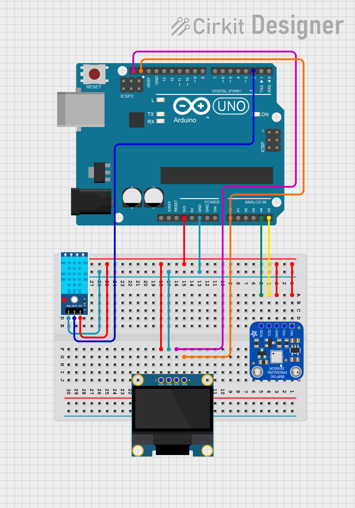
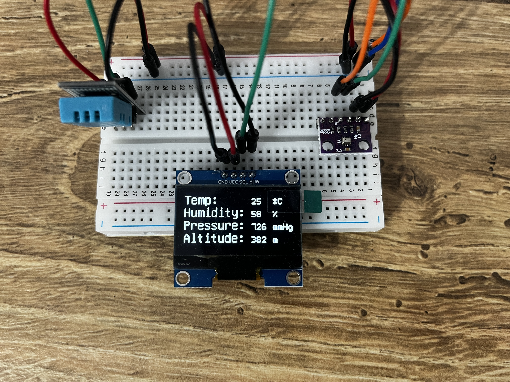

# Weather-Station-with-Arduino

This project demonstrates how to build a weather station using an Arduino UNO R3, a DHT11 sensor, a BMP280 sensor, and a 0.96" 128x64 OLED display. The weather station is capable of measuring temperature, humidity, atmospheric pressure and altitude.

## Components Used
- Arduino UNO R3
- DHT11 Sensor (temperature and humidity)
- BMP280 Sensor (atmospheric pressure and altitude)
- OLED Display 0.96" 128x64

## Features
- **Temperature Measurement**: Uses the DHT11 sensor to measure the ambient temperature.
- **Humidity Measurement**: Uses the DHT11 sensor to measure the relative humidity.
- **Atmospheric Pressure Measurement**: Uses the BMP280 sensor to measure the atmospheric pressure.
- **Altitude Calculation**: Uses the BMP280 sensor to calculate altitude based on the pressure measurement.
- **OLED Display**: Displays the measured temperature, humidity, pressure, and altitude on a small OLED screen.

## Circuit Diagram
The circuit diagram shows the connections between the Arduino UNO, the DHT11 sensor, the BMP280 sensor, and the OLED display.


## Photos of the Project
Here are some photos of the assembled project:



## Code
The code for this project initializes the sensors, reads data from them, and displays the data on the OLED screen. The code is written in Arduino C/C++ and uses the following libraries:
- `Wire.h` for I2C communication.
- `Adafruit_BMP280.h` for interfacing with the BMP280 sensor.
- `SimpleDHT.h` for interfacing with the DHT11 sensor.
- `U8glib.h` for controlling the OLED display.

```
#include <Wire.h> //Library for I2C communication
#include <Adafruit_BMP280.h> //Library for BMP280 sensor
#include <SimpleDHT.h> //Library for DHT11 sensor
#include <U8glib.h> //Library for OLED display

//Define the width and height of the OLED display
#define SCREEN_WIDTH 128
#define SCREEN_HEIGHT 64

//Initialize the OLED display object
U8GLIB_SH1106_128X64 u8g(U8G_I2C_OPT_NONE);  // I2C / TWI

//Initialize the BMP280 sensor & DHT11 sensor objects
Adafruit_BMP280 bmp;
SimpleDHT11 dht11;

void setup() {
  //Begin serial communication at 96000 rate
  Serial.begin(9600);
  while (!Serial) delay(100); //wait for the serial communication to be ready

  //Initialize BMP280 sensor
  if (!bmp.begin(0x76)) {
    Serial.println(F("Could not find a valid BMP280 sensor, check wiring or try a different address!"));
    while (1) delay(10); //infinite loop if sensor initialization fails
  }

  u8g.setFont(u8g_font_unifont); //set the font for the display
}

void loop() {
  int temperature, humidity, pressure, altitude;

  // Read BMP280
  pressure = bmp.readPressure() / 133.3; // Convert to mmHg
  altitude = bmp.readAltitude(1013.25); // Adjusted to local forecast

  // Read DHT11
  byte temp, hum;
  byte data[40] = {0};
  if (dht11.read(2, &temp, &hum, data)) {
    Serial.println("Read DHT11 failed");
    return; //exit loop if reading fails
  }
  temperature = (int)temp; //convert byte to int for temp
  humidity = (int)hum; //convert byte to int for humidity

  // Draw on OLED
  u8g.firstPage();
  do {
    //Set font and draw labels on the display
    u8g.setFont(u8g_font_unifont);
    u8g.drawStr(0, 15, "Temp:");
    u8g.drawStr(0, 30, "Humidity:");
    u8g.drawStr(0, 45, "Pressure:");
    u8g.drawStr(0, 60, "Altitude:");

    //Set font and draw the sensor readings on the display
    u8g.setFont(u8g_font_fixed_v0r);
    u8g.setPrintPos(80, 15);
    u8g.print(temperature);
    u8g.drawStr(105, 15, "*C");
    u8g.setPrintPos(80, 30);
    u8g.print(humidity);
    u8g.drawStr(105, 30, "%");
    u8g.setPrintPos(80, 45);
    u8g.print(pressure);
    u8g.drawStr(105, 45, "mmHg");
    u8g.setPrintPos(80, 60);
    u8g.print(altitude);
    u8g.drawStr(105, 60, "m");
  } while (u8g.nextPage()); //continue drawing until all pages are done

  delay(2000); //delay for 2 seconds before the next reading
}
```

## How to Build
1. **Connect the Components**: Follow the circuit diagram to connect the DHT11 sensor, BMP280 sensor, and OLED display to the Arduino UNO.
2. **Upload the Code**: Open the provided code in the Arduino IDE and upload it to the Arduino UNO.
3. **Power the Arduino**: Once the code is uploaded, power the Arduino using a USB cable or an external power source.
4. **View the Data**: The OLED display will show the measured temperature, humidity, pressure, and altitude.

## Additional Information
- **Libraries**: Make sure to install the required libraries (`Wire`, `Adafruit BMP280`, `SimpleDHT` and `U8glib`) through the Arduino Library Manager.
- **Sensor Calibration**: Adjust the altitude calculation in the code by setting the local sea-level pressure (1013.25 hPa is the standard, but it can vary).
- **Troubleshooting**: If the sensors are not detected, double-check the wiring and ensure the correct I2C addresses are used.

Feel free to explore, modify, and improve this project. Contributions are welcome!
